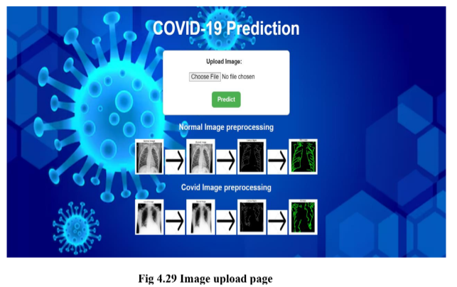
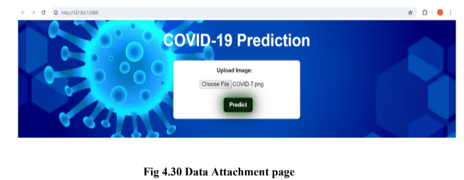
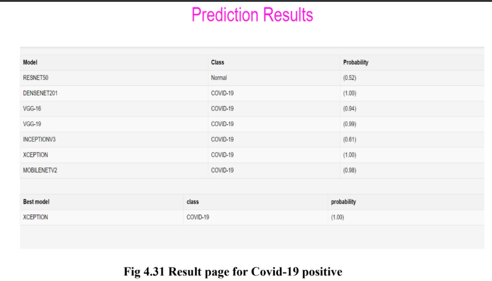
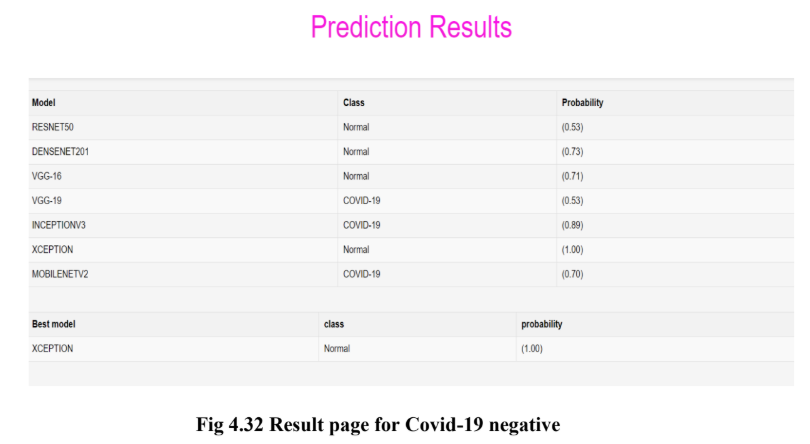

Developed a mobile-friendly web app for COVID-19 diagnosis using 7 transfer learning models, achieving 97%
accuracy with chest X-ray images. Integrated a user-centric front-end (HTML, CSS) with a Flask back-end, ensuring 95% system reliability.

## Project Output
## Home Page

## Data Upload Page

## Prediction result for Covid Positive

## Prediction result for Covid Negative

